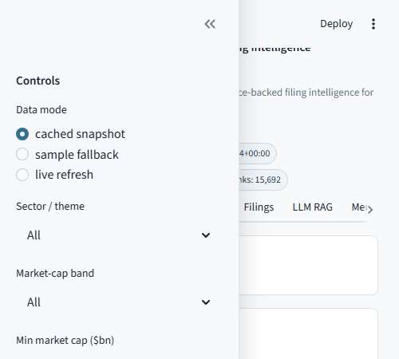
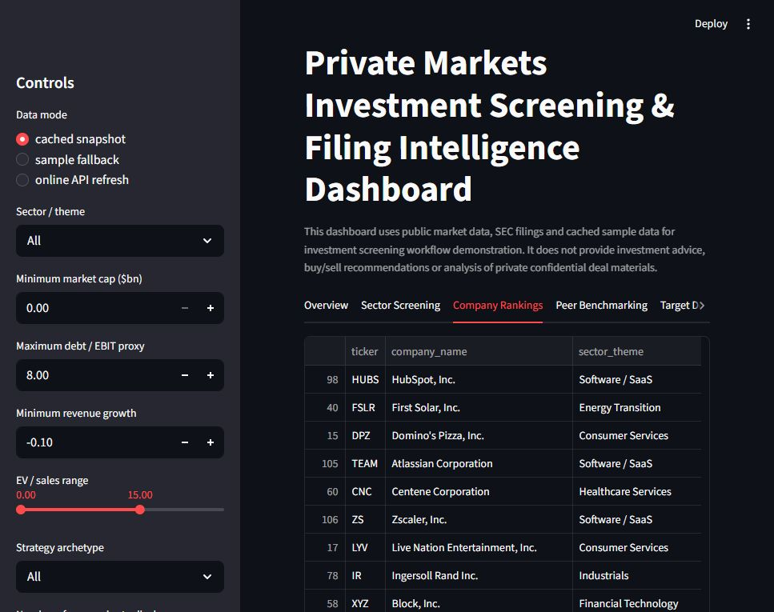
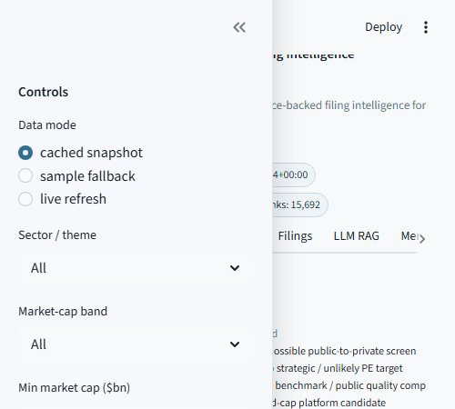
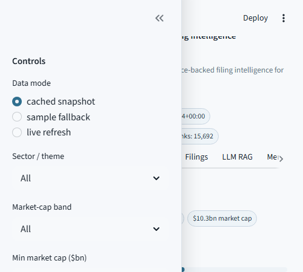
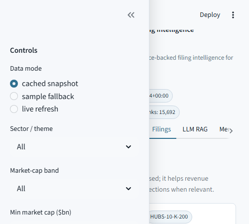
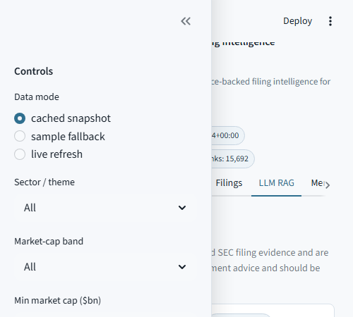
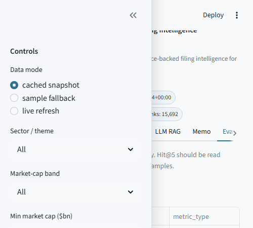

# Private Markets Investment Screening & Filing Intelligence Dashboard

***In Progress***

## Overview

This project is a public-data investment screening and SEC filing intelligence workflow for private-markets-style diligence. It screens listed-company comparables across configurable sectors, calculates transparent scorecards, benchmarks companies against peers, retrieves source-backed filing evidence, and produces a recruiter-facing Streamlit dashboard, Excel workbook, charts and diligence-style reports.

The project does **not** provide investment advice, buy/sell recommendations, price targets or confidential deal analysis. Companies are ranked as candidates for further diligence based on transparent public-data criteria.

## Why I Built This

Private equity, co-investment, secondaries, infrastructure, private credit and portfolio-monitoring teams often need to screen large public comparable universes before deeper diligence. This project demonstrates that workflow in Python: public market data, SEC XBRL fundamentals, filing text retrieval, peer benchmarking, risk flags and source-backed memo output.

## What Makes This Distinct

- Combines yfinance market data with SEC EDGAR/XBRL fundamentals and filing text.
- Separates public-market quality from private-markets feasibility.
- Penalises mega-cap benchmark comps for PE platform/public-to-private suitability.
- Uses deterministic scorecards, not black-box recommendations.
- Adds query-intent section routing for filing evidence retrieval.
- Supports optional local Ollama language-model summaries while running fully without any model.
- Evaluates retrieval quality and generated-answer groundedness separately.

## Data Sources

- **yfinance:** market cap, enterprise value-style fields, price history, valuation metadata, volatility and drawdown. yfinance is an unofficial open-source library using Yahoo Finance publicly available interfaces and should be treated as research/educational data.
- **SEC EDGAR/XBRL:** company ticker/CIK mapping, companyfacts fundamentals, filing metadata and real 10-K filing text. SEC XBRL tags vary by company and require careful mapping.
- **Cached snapshots and sample fallback:** included so the project remains reproducible if external data calls fail. Fallback rows are explicitly labelled with `source_type`.

## Runtime Modes

Configured in `config/universe_config.yaml`:

- `demo`: around 100 companies and 20 real filing downloads for fast dashboard demos.
- `portfolio`: main GitHub headline mode; attempts up to 300 companies and 35 real filing downloads.
- `extended`: optional local scalability mode for larger universes; raw caches and large local outputs should not be committed.

Current committed outputs use **portfolio mode**.

## Screening Methodology

The pipeline loads a configured universe, fetches public market data, maps tickers to SEC CIKs, normalises SEC companyfacts and calculates peer-relative metrics:

- growth: latest revenue growth and 3-year revenue CAGR
- margins: gross, EBIT proxy and net margin
- cash conversion: operating cash flow conversion, FCF proxy and capex intensity
- leverage/liquidity: debt/EBIT proxy, net debt/EBIT proxy and cash/revenue
- valuation: EV/sales and EV/EBIT proxy
- market risk: drawdown from 52-week high, realised volatility and beta
- data reliability: field completeness, filing staleness, peer count and source type

EBIT is labelled as an EBIT proxy and is not silently called EBITDA.

## Scorecards

The dashboard maintains these transparent 0-100 scorecards:

- Public Quality Score
- Investment Screening Score
- Platform Candidate Score
- Public-to-Private Feasibility Score
- Value Creation Potential Score
- Credit Risk Score
- Red Flag Score
- Data Quality Score

Weights live in `config/scoring_config.yaml`.

## Company Categories

Companies are categorised into:

- Public Market Quality Compounder
- Benchmark Quality Comp
- High Priority for Further Diligence
- PE Platform Candidate
- Public-to-Private Candidate
- Value / Re-rating Candidate
- Operational Improvement Candidate
- Leveraged Credit Watchlist
- Distressed / Special Situations Watchlist
- Low Priority / Reject
- Insufficient Data

These categories are screening archetypes, not recommendations.

## Public Quality vs Private Markets Suitability

Mega-cap companies such as MSFT, CRM or ADBE can rank highly on public quality, but they are not automatically treated as PE platform or public-to-private targets. Market-cap and enterprise-value bands are used to separate benchmark quality comps from smaller or mid-cap companies that may be more plausible private-markets diligence screens.

## Peer Benchmarking

For each sector/theme, the project calculates peer medians, quartiles, percentile ranks and gaps versus peers for growth, margin, valuation, leverage, cash conversion and volatility. The dashboard includes peer tables, scatter plots and a selected-company radar view.

## SEC Filing Intelligence / RAG Layer

The filing layer downloads and parses real SEC filings where available, chunks filing text by section, and retrieves evidence using TF-IDF search with transparent section boosts. Query-intent routing improves evidence quality:

- revenue/business model questions boost Business, MD&A and Segment sections
- liquidity/debt questions boost Liquidity, Debt and MD&A
- risk/regulation questions boost Risk Factors, Legal and Regulatory sections
- margin pressure questions boost MD&A and Risk Factors
- capex/investment questions boost MD&A, Liquidity and investment-related sections

Retrieved rows include query type, source type, filing type/date, section, chunk ID, keyword score, section boost, combined score, snippet, source URL and section-match flag.

## Optional Local LLM RAG Layer

The project runs without any language model by default. Deterministic/template-based answers are used for reproducible committed outputs.

Optional local generation is supported through Ollama:

- provider: `ollama`
- base URL: `http://localhost:11434`
- model configurable via `OLLAMA_MODEL`
- default model setting: `qwen3`
- no paid API required
- no external cloud key required

If Ollama is unavailable, the app falls back to deterministic output and shows a warning. Local model output is constrained to retrieved filing evidence and is evaluated for citations, evidence overlap, banned recommendation language and unsupported-claim warnings.

## RAG Evaluation

The gold set includes 96 diligence questions across answerable, section-confuser and no-answer cases. Retrieval evaluation distinguishes Hit@K from Precision@K because finding one useful passage is different from returning a clean evidence set.

Current portfolio-mode retrieval results:

- Hit@3: 100.0%
- Hit@5: 100.0%
- Precision@3: 98.1%
- Precision@5: 89.4%
- MRR: 100.0%
- Section match rate: 100.0%
- Citation coverage: 100.0%
- Unsupported-claim rate: 0.0%
- No-answer accuracy: 100.0%

These are retrieval-benchmark results, not a legal or investment diligence completeness guarantee.

## Grounded Generation Evaluation

Current committed generated answers use deterministic mode:

- Answers evaluated: 80
- Citation coverage: 100.0%
- Unsupported-claim rate: 0.0%
- Evidence overlap score: 77.4%
- Banned-language count: 0
- No-answer accuracy: 100.0%
- Numeric consistency pass rate: 100.0%
- Groundedness score: 100.0%

Local Ollama generation is optional and model-dependent. On this machine, Ollama was reachable and `qwen3` was available, but committed headline outputs remain deterministic for reproducibility.

## Dashboard Preview

Screenshots are saved in `outputs/screenshots/`:









## Example Outputs

- Excel workbook: `outputs/excel/private_markets_screening_outputs.xlsx`
- Investment screening memo: `outputs/reports/investment_screening_memo.md`
- Filing evidence report: `outputs/reports/filing_evidence_report.md`
- RAG evaluation report: `outputs/reports/rag_evaluation_report.md`
- Grounded generation evaluation report: `outputs/reports/grounded_generation_eval_report.md`
- Charts: `outputs/charts/`

## Headline Results

Portfolio mode generated the following committed snapshot:

- 288 companies attempted across 12 sectors/themes
- 283 companies successfully screened
- 283 companies with yfinance market data
- 280 companies with SEC fundamentals
- 259 companies with usable revenue fundamentals
- 35 companies with real SEC filing chunks
- 35 real SEC filing documents parsed
- 15,965 filing chunks indexed
- 15,692 real SEC filing chunks and 273 sample fallback chunks
- Average Data Quality Score: 72.6
- Top Investment Screening Score companies: HUBS, ROKU, FSLR, OKTA, TOST, ETSY, DOCU, BILL, EVR, NI
- RAG Precision@5: 89.4%
- Grounded generation score: 100.0%
- Tests: 23 passed

## Project Structure

```text
config/          runtime, scoring, SEC and RAG configuration
data/            raw cache folders, interim snapshots, processed outputs and samples
dashboard/       Streamlit dashboard
eval/            gold retrieval question set
notebooks/       walkthrough notebook
outputs/         charts, screenshots, Excel workbook and reports
src/             ingestion, scoring, retrieval, generation, evaluation and reporting modules
tests/           pytest coverage for data, scoring, retrieval, generation and outputs
```

## How To Run

```bash
pip install -r requirements.txt
py -m src.universe
py -m src.yfinance_client
py -m src.sec_client
py -m src.screening_pipeline
py -m src.filing_parser --mode hybrid
py -m src.filing_rag
py -m src.rag_generator
py -m src.retrieval_eval
py -m src.grounded_generation_eval
py -m src.reporting
py -m pytest
py -m streamlit run dashboard/app.py
```

Use `--runtime-mode demo`, `--runtime-mode portfolio` or `--runtime-mode extended` where supported.

## Optional Ollama Setup

Install Ollama separately, then pull a local model:

```bash
ollama pull qwen3
ollama pull llama3.1
ollama serve
```

Configure:

```bash
set LLM_ENABLED=true
set OLLAMA_MODEL=qwen3
```

Then run:

```bash
py -m src.rag_generator --llm
py -m src.grounded_generation_eval
py -m streamlit run dashboard/app.py
```

Ollama is optional. If the server or model is unavailable, deterministic outputs are used.

## Tests

The test suite covers universe loading, ticker failure logging, SEC mapping and XBRL fallbacks, scoring bounds, mega-cap category handling, data-quality penalties, filing source types, section-boosted retrieval, no-answer handling, local Ollama fallback, generation guardrails, groundedness metrics, chart/report/workbook output and dashboard import safety.

Current result: `23 passed`.

## Data Limitations

- yfinance is unofficial and can fail, change fields or return stale/missing data.
- SEC companyfacts are official public data, but tags vary across issuers and require mapping.
- Filing section parsing is imperfect because filing formats vary.
- Real filing coverage is intentionally capped for commit-safe outputs.
- Sample fallback rows support offline reproducibility and are clearly labelled.
- Retrieval and generation outputs support workflow demonstration and require human review.

## Investment Advice Disclaimer

This project is not a stock-picking system, buy/sell engine, price-target model or investment recommendation tool. Outputs identify public companies that screen for further diligence under configurable criteria. Any real investment decision would require full professional diligence, source filing review, legal analysis, financial analysis and investment committee judgment.

## Future Enhancements

- Add more real SEC filings in extended local mode.
- Add richer section parsing for 10-Q filings and footnotes.
- Add local embedding retrieval as an optional second-stage reranker.
- Add historical refresh tracking and sector-specific scoring presets.
- Add richer evidence-level labelling for gold retrieval examples.

